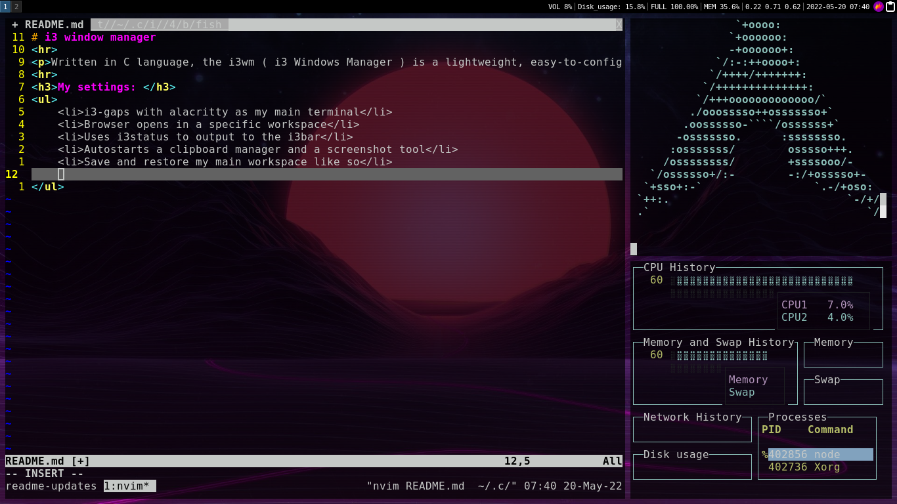

# Alacritty
Alacritty is a modern terminal emulator that comes with sensible defaults, but allows for extensive configuration. By integrating with other applications, rather than reimplementing their functionality, it manages to provide a flexible set of features with high performance.
<h3>My config: </h3>
<ul>
    <li>Transparent background</li>
    <li>Tmux autostart</li>
    <li>Dark aesthetic</li>
</ul>

